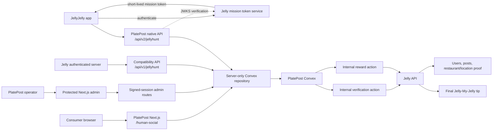
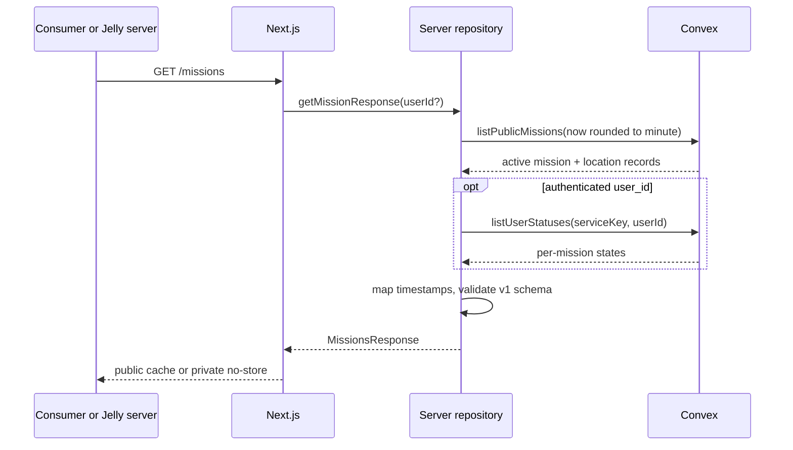
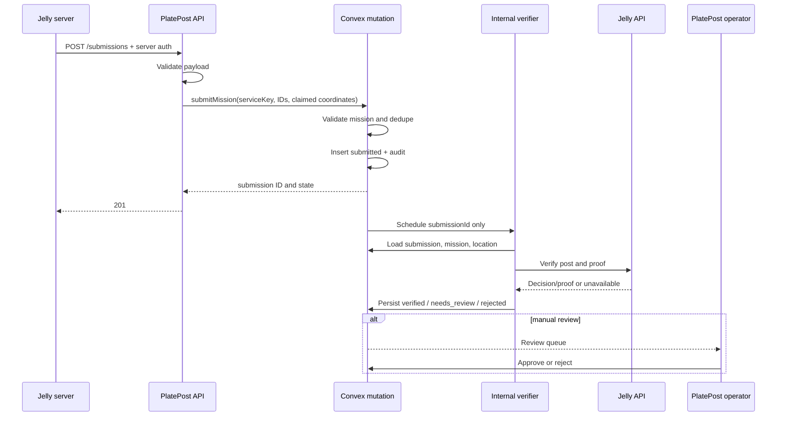
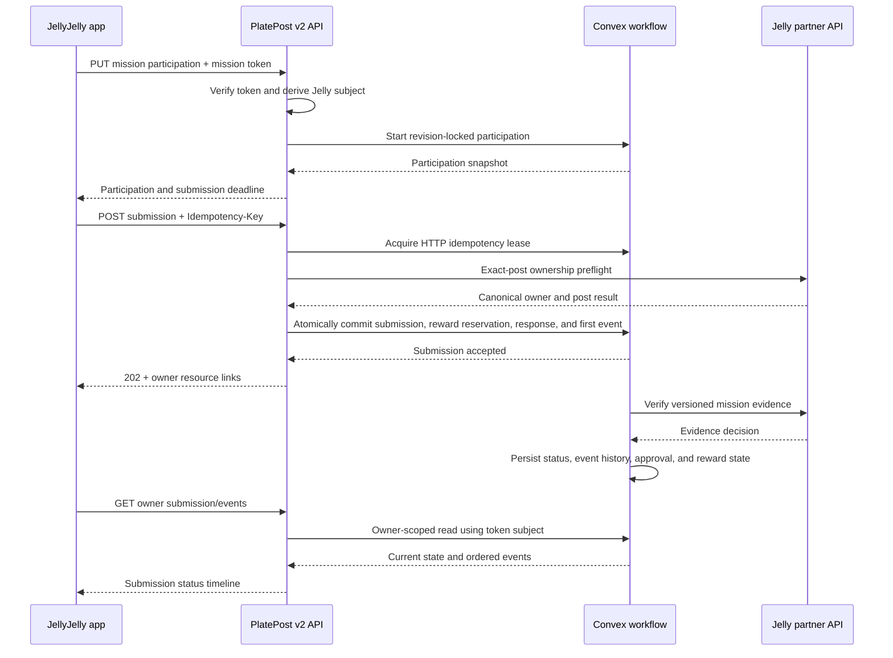
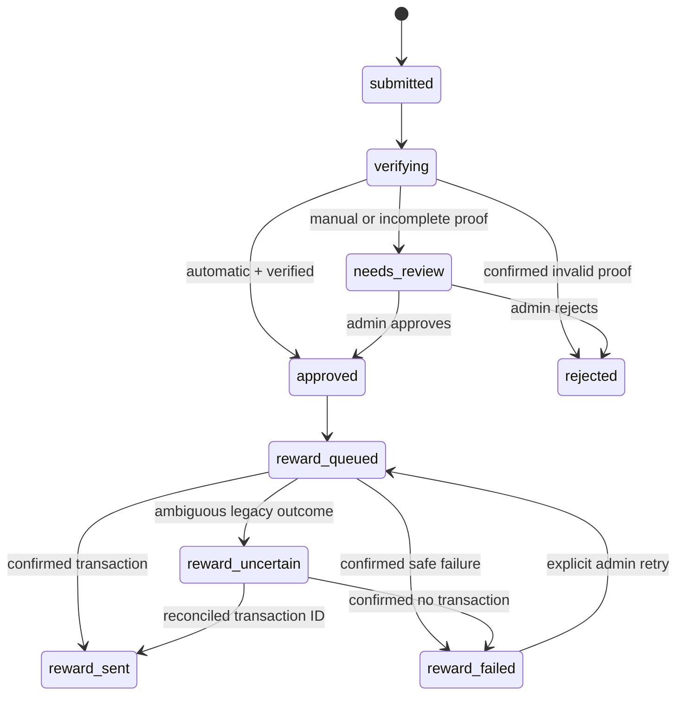

# Architecture

## Purpose

This document describes the implemented PlatePost JellyHunt architecture. Native v2 is the direct JellyJelly integration target; v1 remains a transitional compatibility surface. The binding native contract is the [OpenAPI document](../openapi/jellyhunt-v2.yaml), supported by the [Native Mission API v2 design](superpowers/specs/2026-07-16-platepost-jelly-native-api-v2-design.md).

> **Delivery status:** this is the target runtime architecture. The code is merged in GitHub, but Vercel deployment is paused and shared PlatePost Convex is not connected.

This service moves Jellyhunt operations out of hardcoded JellyJelly website data and into a PlatePost-owned backend. It has three consumers:

- The **PlatePost x JellyJelly: Human Social!** map that PlatePost is designed to host.
- PlatePost operators managing missions and reviewing completions.
- The JellyJelly native app and Jelly server.

The central boundary is deliberate: PlatePost owns the mission program and its workflow; Jelly owns social content, identity, trusted proof, and money movement.

## Runtime topology

Browser code never receives `PLATEPOST_CONVEX_SERVICE_KEY`, Jelly partner credentials, reward credentials, or the admin session signing secret.

## Source-of-truth ownership

### PlatePost / Convex

- Mission display content and lifecycle.
- Mission-specific location, coordinates, timezone, and geofence.
- Scheduling, sort order, category, difficulty, hours, and reward configuration.
- Submission records and state transitions.
- User/mission deduplication and global Jelly-post reuse prevention.
- Verification results copied from Jelly.
- Admin decisions, rejection reasons, reward attempts, and reconciliation state.
- Audit history and the native-facing Jellyhunt contract.

### Jelly

- User authentication and canonical user IDs.
- Jelly post/video existence and canonical post IDs.
- Authorship.
- Canonical place association and versioned component evidence; generic topics, hashtags, or client-writable metadata are never authoritative proof.
- Trusted post geolocation.
- Jelly-My-Jelly balances and the final transaction.
- The final transaction ID.

PlatePost stores foreign IDs for correlation; it does not replicate full Jelly users or posts.

## Migration boundary

`migrations/legacy-jellyhunt-missions.json` is schema-validated and inventoried one-time input, not a runtime data source. The importer defaults to dry-run, requires an explicit `--apply`, skips existing slugs, and refuses anything except 16 draft/manual records. It writes through the same atomic mission/location mutation as the admin and cannot publish or reward. After import, Convex is the only operational source of truth; provisional addresses, coordinates, tags, geofences, timezone assumptions, hours, schedules, copy, and rewards require human approval.

## Next.js responsibilities

### Consumer map

`/human-social` is a server-rendered entry point. Its server component reads through the server-only Convex repository, then passes validated public mission objects to the client explorer. `/map` redirects to this canonical route.

The client explorer provides:

- Mapbox GL with mission markers when `NEXT_PUBLIC_MAPBOX_ACCESS_TOKEN` exists.
- A coordinate-projected fallback map when Mapbox is unavailable.
- Search and category/status filters.
- Marker and list selection.
- Browser geolocation and Haversine distance.
- Timezone-aware open/closed calculations, including overnight ranges.
- Mission details, directions, JellyJelly camera deep link, and direct store links.

The fallback exists for development and graceful degradation; it is not a replacement for configuring Mapbox in production.

### HTTP API

The canonical native surface is under `/api/v2/jellyhunt`; `/api/v1/jellyhunt` remains available only as the compatibility boundary. Next.js validates authentication and contracts before calling Convex.

- Public v2 discovery, places, Jelly feeds, and leaderboards expose only public projections.
- Personalized v2 reads derive the viewer from a short-lived Jelly-signed mission token.
- Participation and submission writes require token scope plus server-enforced idempotency.
- v1 personalized calls remain server-to-server behind the transitional shared key; Production v1 submission writes return `410 Gone`.
- Both API versions map to the same canonical namespaced Convex records.

See [API reference](API.md).

### Admin gateway

The browser admin uses a signed, 12-hour HTTP-only, SameSite=Strict session. Authenticated Next.js route handlers call private Convex functions with `PLATEPOST_CONVEX_SERVICE_KEY`; mutation routes also enforce same-origin requests. The service key never enters browser code.

Mission and location saves use one transactional Convex mutation. Dashboard schedule inputs are interpreted in the location IANA timezone. Submission reviews show the immutable restaurant/location/reward snapshot, claimed and verified GPS/distance, verification summary, and Jelly post link so an operator decides against the terms accepted at submission time.

## Convex data model
All canonical workflow tables are namespaced with `jellyhunt*`. The standalone root schema also spreads generic legacy tables as noncanonical transitional artifacts for compatibility; shared integration must explicitly exclude or collision-review them. The v1 route names are compatibility URLs, not canonical table names.

### `jellyhuntPlaces`

Stores the mission-specific place:

- Display name and address.
- Optional Jelly restaurant ID.
- Latitude and longitude.
- Geofence radius in meters.
- IANA timezone.
- Creation and update timestamps.

### `jellyhuntMissions` and `jellyhuntMissionRevisions`

Store editable mission configuration plus immutable published terms:

- Slug, title, description.
- `draft | active | paused | archived`.
- `manual | automatic` approval; automatic configuration requires partner verification.
- Location relation and restaurant tag.
- Positive Jelly-My-Jelly reward capped by `JELLYHUNT_MAX_REWARD_AMOUNT` (default `10000`); the current ceiling is revalidated again at activation.
- Category, difficulty, emoji, neighborhood, price, hours, and optional showtimes.
- Sort order, optional venue URL, optional start/end schedule.
- Monotonic revision number, creator, and timestamps. Full mission/location edits increment the mission revision; lifecycle-only status changes do not create new proof terms.

Only active, currently scheduled missions are returned publicly.

### `jellyhuntParticipations`, `jellyhuntSubmissions`, and `jellyhuntSubmissionEvents`

Store revision-locked participation, submission attempts, and owner-visible status history:

- Stable dedupe key and the mission revision accepted at submission time.
- Workflow status.
- Immutable snapshots of the mission title, approval mode, restaurant tag, place identity, coordinates/geofence, reward amount, and token.
- Optional client-claimed coordinates.
- Optional Jelly-verified coordinates and computed distance.
- Verification summary, rejection reason, attempts, and reward transaction ID.
- Timestamps.

Indexes support mission/user checks, exact dedupe, global post reuse prevention, and status queues.

### `jellyhuntRewardBudgets`, reservations, intents, and attempts

Store campaign/mission capacity, reservations, one immutable reward intent, and attempt records keyed for idempotency:

- Submission relation and idempotency key.
- Immutable reward amount, token, and mission title copied from the submission snapshot.
- `queued | processing | sent | failed | uncertain`.
- Jelly transaction ID and an allowlisted error summary; arbitrary upstream response bodies are discarded.
- A two-minute processing lease moves an abandoned worker to `uncertain` for reconciliation.
- Timestamps.

### `jellyhuntAuditEvents`

Stores append-only operator and workflow history:

- Actor, action, entity type and ID.
- Previous and next state.
- JSON metadata that must not contain secrets.
- Timestamp.

## Mission read path

The public map calls the v1-compatible server repository directly instead of making an HTTP round trip to its own API. Native v2 uses a separate repository and contract projection. Both projections read the same canonical namespaced Convex mission records, but each validates and maps the response shape required by its consumer.

The repository supplies a caller-derived current time rounded down to the minute because Convex queries are deterministic and cacheable. Convex applies the coarse schedule window, then the Next.js repository rechecks visibility against the exact current time. Mission starts therefore have up to one minute of publication granularity; expired missions are removed by the exact check.

## v1 compatibility submission and verification path

The internal action accepts only `submissionId`. It loads the expected user and post plus the immutable restaurant tag, location, geofence, approval mode, and mission revision captured when the submission was created. A later admin edit cannot change the proof requirements for an in-flight or historical submission, and a caller cannot choose verification criteria.

## Canonical native v2 participation and submission path

In v2, the Jelly user ID is derived from the verified mission token rather than accepted from the request body. Participation locks the mission revision before posting. Submission intake uses HTTP idempotency, exact-post preflight, and an atomic Convex commit so the attempt count, reward reservation, stored response, and owner-visible first event cannot diverge. Verification and manual review append owner-visible events as the submission and reward states advance.

### Deduplication rules

1. The exact normalized `missionId:jellyUserId:jellyPostId` key is idempotent and returns the existing record.
2. A Jelly post may not be used for another mission.
3. A user may not create a second non-rejected submission for the same mission.
4. A rejected attempt may be followed by a new post for the mission. Once another attempt is non-rejected, the older rejected record cannot be approved, reverified, or queued for reward.

The database enforces these rules at submission time; the client UI is not authoritative.

## Verification adapters

All outbound Jelly verification and reward HTTP calls use a 10-second timeout and credential-bearing non-loopback endpoints require HTTPS. Verification timeout moves the submission to review; a legacy reward timeout becomes uncertain because Jelly may have processed it.

### Partner mode

When `JELLY_PARTNER_VERIFY_URL` is configured, the internal action posts database-derived proof requirements to that URL with `JELLY_PARTNER_API_KEY`. The expected result is:

- `outcome: verified | needs_review | rejected`, or a compatible `passed` boolean.
- A human-readable summary and optional reason.
- Trusted coordinates and a non-negative distance for any `verified` decision.

PlatePost recomputes distance, cross-checks the supplied distance, routes missing or inconsistent proof to `needs_review`, and rejects proof outside the configured geofence. Convex permits `automatic` mission configuration only when both the partner verification URL and key are present; legacy verification remains review-first.

### Legacy mode

Without a partner URL, PlatePost reads `GET /v3/jelly/<postId>`, optionally using `JELLY_LEGACY_API_TOKEN`.

The legacy response can expose `started_by_id`, broad topics, and `xdata`, which PlatePost examines for restaurant and coordinate hints. A successful legacy fetch never produces authoritative verification: it always enters `needs_review`, even when all hints are present. An explicit author mismatch is rejected; a confirmed missing post is rejected as nonexistent. Transport or server outages also move to review rather than payout.

A production partner verification contract is the preferred launch path.

## Review and reward path

Only `needs_review` can be approved directly; rejected proof must be reverified. Approval checks every sibling attempt for the same user and mission, then creates or reuses a reward attempt with `jellyhunt:<submission dedupe key>` and copies the immutable reward terms into it. The internal reward action accepts only `rewardAttemptId`, then loads recipient, post, token, amount, and title from Convex. Later mission edits cannot change a queued or retried payout. A two-minute watchdog turns an abandoned `processing` attempt into `reward_uncertain`; it never resends automatically.

### Partner rewards

When `JELLY_PARTNER_REWARD_URL` is configured, PlatePost sends the stable `Idempotency-Key` header. The partner endpoint must guarantee that repeated calls with the same key return the same transaction outcome and do not double-tip.

### Legacy rewards

Without the partner URL, PlatePost calls `POST /crypto/send`. `JELLY_REWARD_API_TOKEN` is the preferred dedicated credential; `JELLY_LEGACY_API_TOKEN` is a fallback, and `JELLY_REWARD_BEARER_TOKEN` remains for compatibility. `JELLY_REWARD_AUTH_SCHEME` may select `Token` or `Bearer`; API/legacy tokens default to `Token`. The legacy endpoint has no documented idempotency guarantee:

- A clear success becomes `reward_sent`.
- A clear non-retryable failure becomes `reward_failed`.
- A network error, timeout-like status, rate limit, or server response that may have processed the request becomes `reward_uncertain`.
- Only confirmed `reward_failed` attempts may be retried.
- `reward_uncertain` requires Jelly transaction reconciliation before any further payout action. An operator may then record a confirmed Jelly transaction ID as sent or a documented no-transaction result as failed; the reconciliation writes an audit event.

## Security model

| Boundary | Control |
| --- | --- |
| Anonymous public mission read | Only active public mission fields; no user state. |
| User-specific read | `x-jellyhunt-api-key` on the Next.js server. |
| Submission write | Same server-only Jelly integration key. |
| Next.js to private Convex | `PLATEPOST_CONVEX_SERVICE_KEY` on both servers. |
| Admin browser | Signed HTTP-only session; server route gateway. |
| Convex to Jelly partner | Bearer partner key in Convex environment; HTTPS is required outside non-production loopback. |
| Legacy reward | `Token` credential by default, with optional `Bearer` compatibility, in the Convex environment. |
| Reward input integrity | Internal action accepts only reward-attempt ID, reads amount/recipient from Convex, blocks live sibling attempts, and discards raw upstream response bodies. |
| Secrets | Never stored in mission data, audit metadata, response payloads, source control, or `NEXT_PUBLIC_*`. |

The shared Jelly API key is not suitable for embedding in a native app. The target production model is a short-lived Jelly-signed token with user identity and audience claims that PlatePost validates.

## Failure policy

- Invalid client input is rejected before Convex.
- Missing configuration fails closed; production never silently falls back to fixtures.
- Jelly verification outages move work to review/retry and do not reject a user solely for downtime.
- Reward uncertainty never triggers an automatic retry; an abandoned processing lease becomes uncertain for reconciliation.
- Operators pause or archive missions rather than deleting operational records.
- Every material state change writes an audit event.

## Target deployment topology
This topology is intentionally not deployed yet. GitHub is the current delivery boundary; PlatePost must explicitly resume hosting and link the exact existing Vercel project before Preview work begins.

- Vercel will host the Next.js site and HTTP boundary under the PlatePost organization.
- Convex will host the database, private functions, schedulers, and Jelly actions.
- Mapbox will serve the consumer basemap using a public token.
- Jelly APIs remain external and server-to-server.

Preview and Production must use different Convex deployments and credentials. A production acceptance test is not complete until an admin edit changes the Convex record and appears on `/human-social` and `GET /missions` without a code deployment.

## Known architectural gaps before launch

- Original visual/discovery-map parity is implemented and verified against the 16-mission local fixture; production parity still requires the reviewed Convex import and live token acceptance. Passport and Editorial Map shells are implemented. Leaderboard queries, rankings, and all-time/current-season API responses are implemented; real usernames and eligibility still depend on Jelly's profile contract. Product must decide whether Jelly Library/auth and signed personal progress/profile stay native-only or become later PlatePost phases.
- Native SSO, post selection/submission, and status refresh remain a Jelly/PlatePost launch integration.
- PlatePost Production Convex is not connected and no production mission data has been imported.
- Generated bindings and local Convex typechecking are complete; PlatePost development access is still required for the reviewed shared-schema push, seeding, and live workflow acceptance.
- Jelly and PlatePost must finalize the partner verification schema and proof trust rules.
- Jelly must provide an idempotent partner reward contract or a reliable transaction lookup for reconciliation.
- The protected admin dashboard and operator workflow must pass live Convex browser testing.
- Admin login needs Vercel WAF/platform rate limiting and failed-login monitoring before public exposure.
- Duplicate/reused-post conflicts now preserve stable `409` responses; remaining business-rule and malformed-JSON failures need final HTTP normalization.
- The v2 token verifier is implemented; Jelly must issue the signed mission token/JWKS and adopt v2 in the native app while the v1 shared key remains transitional server-only compatibility.
